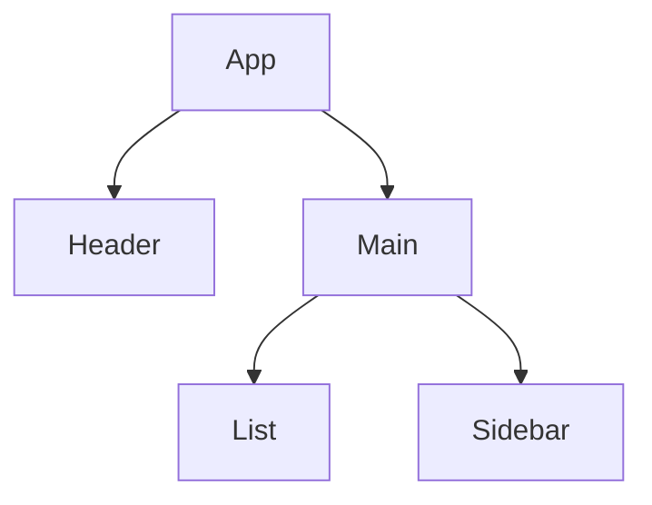

# 03. Fiber Node 데이터 구조

## 비유 소개: 지도 앱의 "현재 위치 포인터"

종이 지도를 재귀로 훑으면 중간 저장이 어렵지만,
내비게이션처럼 "현재 위치 포인터"를 갖고 있으면 언제든 멈추고 다시 시작할 수 있습니다.

## 문제 정의

재귀 트리 순회는 콜스택에 의존합니다.

- 중간 중단/재개가 어려움
- 우선순위 변경이 힘듦
- 진행 상태를 외부에서 조작하기 어려움

## 해결 방법: 연결 리스트형 Fiber Node

Fiber는 각 노드가 다음 탐색 방향을 직접 가리키는 포인터를 가집니다.

- `child`: 첫 자식
- `sibling`: 다음 형제
- `return`: 부모

이 구조 덕분에 현재 포인터 하나(`nextUnitOfWork`)로 진행 상태를 복원할 수 있습니다.

## 간소화 의사 코드 (TypeScript)

```typescript
interface FiberNode {
  type: string;
  key: null | string;
  pendingProps: Record<string, unknown>;
  memoizedProps: Record<string, unknown> | null;

  // 트리 탐색 포인터
  child: FiberNode | null;
  sibling: FiberNode | null;
  return: FiberNode | null;

  // 이펙트와 교체 트리 연결
  alternate: FiberNode | null;
  flags: number;
}

function performUnitOfWork(fiber: FiberNode): FiberNode | null {
  beginWork(fiber);

  if (fiber.child !== null) {
    return fiber.child;
  }

  let node: FiberNode | null = fiber;
  while (node !== null) {
    completeWork(node);
    if (node.sibling !== null) {
      return node.sibling;
    }
    node = node.return;
  }

  return null;
}
```

## 왜 중단/재개가 쉬워지나?

- 중단 시점: `nextUnitOfWork`만 저장하면 됨
- 재개 시점: 저장한 Fiber부터 `performUnitOfWork` 다시 호출
- 재귀 콜스택이 아니라 명시적 포인터를 사용하므로 제어가 쉬움

## 시각화



포인터 관점:

- `A.child = B`
- `B.sibling = C`
- `D.sibling = E`
- `B.return = A`, `C.return = A`

## 실습

- 데모의 "Tree Inspector"에서 `current`와 `workInProgress` 트리를 번갈아 확인
- 긴 작업 중에도 포인터 기반으로 재개되는 로그를 확인
