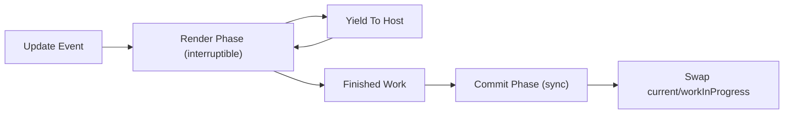

# 04. Render/Commit과 Double Buffering

## 비유 소개: 무대 리허설과 본공연

극장에서 리허설은 중단해도 되지만, 본공연 장면 전환은 관객 앞에서 깔끔하게 끝나야 합니다.
React도 같은 분리를 사용합니다.

## 단계 구분

### Render Phase

- 비동기적
- 중단 가능(Interruptible)
- 새로운 트리(work-in-progress) 계산

### Commit Phase

- 동기적
- 중단 불가능
- 실제 DOM/Ref/Effect 반영

## Double Buffering 개념

React는 두 트리를 번갈아 씁니다.

- `current`: 현재 화면에 반영된 안정 트리
- `workInProgress`: 다음 화면 후보 트리

Render가 끝나면 Commit에서 포인터를 스왑합니다.

## 간소화 의사 코드 (TypeScript)

```typescript
interface FiberRoot {
  current: FiberNode;
  workInProgress: FiberNode | null;
  finishedWork: FiberNode | null;
}

function renderRoot(root: FiberRoot): void {
  root.workInProgress = createWorkInProgress(root.current);
  workLoopConcurrent(root.workInProgress);
  root.finishedWork = root.workInProgress;
}

function commitRoot(root: FiberRoot): void {
  const finishedWork = root.finishedWork;
  if (!finishedWork) return;

  // Commit Phase: 중간 중단 없이 DOM 반영
  commitMutationEffects(finishedWork);
  commitLayoutEffects(finishedWork);

  // Double buffering swap
  root.current = finishedWork;
  root.workInProgress = null;
  root.finishedWork = null;
}
```

## 왜 Commit은 동기여야 하나?

DOM이 중간 상태로 보이면 사용자 경험이 깨집니다.
그래서 Commit은 "짧고 원자적"으로 끝내는 것이 핵심입니다.

## 렌더링 플로우차트



## Before / After 비교

| 항목 | Stack Reconciler | Fiber Reconciler |
| --- | --- | --- |
| 작업 단위 | 재귀 일괄 처리 | 작은 unit으로 분할 |
| 중단 가능성 | 거의 불가 | 가능 (Render Phase) |
| 긴급 업데이트 대응 | 늦어질 수 있음 | 우선순위로 선처리 |
| 프레임 안정성 | 긴 작업에서 하락 | 양보로 개선 |

## 성능 관점 체크리스트

- Render가 길다: 컴포넌트 분할, 메모이제이션, 우선순위 조정
- Commit이 길다: DOM 변경량 최소화, 레이아웃 스래싱 줄이기

## 실습

1. 데모에서 긴 작업 3개를 넣고 `Start Scheduler` 실행
2. Render 로그가 여러 틱으로 쪼개지는지 확인
3. Commit 로그는 각 태스크 완료 시 짧은 구간으로 찍히는지 확인
4. `Swap Count`가 증가하는지 확인
