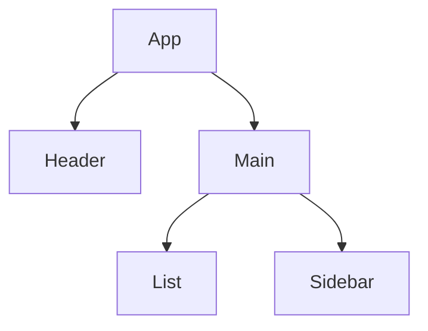

# 03. Fiber 노드와 포인터 순회

## 비유 소개

종이 지도를 재귀적으로 훑는다면 "어디까지 봤는지"를 중간에 저장하기 어렵습니다.
반면 내비게이션처럼 현재 위치 포인터를 명시적으로 들고 있으면 언제든 멈췄다가 같은 위치에서 다시 시작할 수 있습니다.

Fiber 순회가 바로 이 포인터 모델을 사용합니다.

## 문제 정의

재귀 기반 트리 순회는 콜스택에 진행 상태를 묶어 둡니다.

- 중간 중단/재개 지점을 외부에서 제어하기 어렵다
- 우선순위 변경 시 "지금 어디를 처리 중인지" 다루기 어렵다
- 긴 작업에서 사용자 입력을 끼워 넣기 어렵다

즉, Scheduler가 시간을 쪼개더라도
작업 단위 자체가 "다음 노드를 명시적으로 가리키는 형태"가 아니면 중단/재개 모델이 불안정해집니다.

## 해결 방법

Fiber는 각 노드가 탐색 경로를 직접 가리키도록 설계합니다.

- `child`: 첫 자식
- `sibling`: 다음 형제
- `return`: 부모

이 세 포인터만으로도 DFS 순회를 재귀 없이 구성할 수 있습니다.
그리고 현재 작업 포인터(`nextUnitOfWork`) 하나로 진행 상태를 저장/복원할 수 있습니다.

## 기술적 구현 (TypeScript 의사 코드)

```ts
interface FiberNode {
  type: string;
  key: null | string;
  pendingProps: Record<string, unknown>;
  memoizedProps: Record<string, unknown> | null;

  // 트리 순회 포인터
  child: FiberNode | null;
  sibling: FiberNode | null;
  return: FiberNode | null;

  // current <-> workInProgress 쌍을 잇는 링크
  alternate: FiberNode | null;

  // 이펙트/부작용 플래그
  flags: number;
}

let nextUnitOfWork: FiberNode | null = null;

function performUnitOfWork(fiber: FiberNode): FiberNode | null {
  beginWork(fiber);

  if (fiber.child !== null) {
    return fiber.child;
  }

  let node: FiberNode | null = fiber;
  while (node !== null) {
    completeWork(node);

    if (node.sibling !== null) {
      return node.sibling;
    }

    node = node.return;
  }

  return null;
}
```

핵심 포인트:

- 재귀 호출 대신 포인터 이동으로 다음 작업을 결정한다.
- 루프를 멈출 때는 `nextUnitOfWork`만 보관하면 된다.
- 재개 시에는 저장해 둔 Fiber에서 `performUnitOfWork`를 이어 호출하면 된다.

## alternate와 Double Buffering 미리보기

위 인터페이스에서 `alternate` 필드가 눈에 띌 것입니다.
React는 화면에 보이는 트리(**current**)와 작업 중인 트리(**workInProgress**) 두 벌을 유지하며,
이 둘을 `alternate` 포인터로 연결합니다.

DevTools에서 같은 컴포넌트가 두 개의 Fiber로 표시되거나,
디버깅 중 `fiber.alternate`를 찍었을 때 "이전 상태의 복사본"이 보이는 이유가 바로 이 구조 때문입니다.
`alternate`가 왜 필요한지, 두 트리가 언제 교체(스왑)되는지는 04장 Double Buffering에서 상세히 다룹니다.

## 포인터 시각화



위 예시에서 포인터 관계를 읽으면:

- `A.child = B`
- `B.sibling = C`
- `C.child = D`
- `D.sibling = E`
- `B.return = A`, `C.return = A`, `D.return = C`

## 실습 예제 (코드리뷰형)

### 시나리오

트리 순회 중 특정 노드에서 계산량이 커져서 렌더 루프를 잠깐 멈췄다가,
다음 틱에서 다시 이어 실행해야 하는 상황입니다.

```ts
function workLoop(): void {
  while (nextUnitOfWork !== null && !shouldYieldToHost()) {
    nextUnitOfWork = performUnitOfWork(nextUnitOfWork);
  }

  if (nextUnitOfWork !== null) {
    requestHostCallback();
  } else {
    commitRoot();
  }
}
```

### 질문

1. 왜 `nextUnitOfWork` 하나만 저장해도 순회 재개가 가능한가?
2. `return` 포인터가 없다면 어떤 상황에서 다음 노드를 찾기 어려워지는가?
3. 이 구조가 Scheduler의 "중단 후 재개" 모델과 어떻게 맞물리는가?

### 답안 체크리스트

- [ ] 포인터 기반 순회가 재귀 콜스택 의존을 줄인다는 점을 설명했다.
- [ ] `child/sibling/return`의 역할을 각각 구분해 설명했다.
- [ ] 중단 시 상태 저장 단위를 `nextUnitOfWork`로 설명했다.

## 오해 바로잡기

1. **"Fiber는 트리를 연결 리스트로 완전히 대체한다"**
   - 완전히 대체라기보다, 트리 구조를 포인터로 표현해 순회 제어 가능성을 높인 모델에 가깝다.

2. **"`alternate`가 있으면 메모리 사용량이 무조건 2배다"**
   - 단순 배수로 고정되지 않는다. 시점별 재사용/할당 전략에 따라 실제 사용량은 달라진다.

3. **"포인터 구조를 알면 곧바로 성능 최적화가 자동으로 된다"**
   - 아니다. 구조 이해는 진단 정확도를 올려주지만, 최적화는 병목 원인 측정과 분리 전략이 필요하다.

## 요약 체크리스트

- [ ] Fiber 노드의 `child/sibling/return` 의미를 설명할 수 있다.
- [ ] `performUnitOfWork`가 다음 노드를 찾는 흐름을 설명할 수 있다.
- [ ] `nextUnitOfWork`가 중단/재개의 상태 저장점이라는 사실을 설명할 수 있다.
- [ ] `alternate`가 current/workInProgress를 잇는 링크라는 점을 설명할 수 있다.

## 다음 장 예고: Render와 Commit, 그리고 Double Buffering

다음 장에서는 순회 중 계산된 결과가 언제 실제 DOM에 반영되는지,
즉 Render Phase와 Commit Phase 경계를 구체적으로 다룹니다.

- Render/Commit 경계에서 성능 병목을 구분하는 방법
- effect list와 실제 반영 타이밍
- 왜 double buffering이 flicker를 줄이는 데 중요한가
