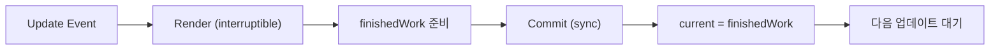

# 04. Render와 Commit, Double Buffering

## 비유 소개

연극 무대에서는 리허설 중 장면을 멈춰도 관객은 모릅니다.
하지만 본공연 중 장면 전환은 중간에 끊기면 바로 어색해집니다.

React도 비슷하게 두 단계를 분리합니다.

- 화면 후보를 계산하는 단계는 멈췄다가 이어도 되는 단계
- 실제 화면을 바꾸는 단계는 짧고 원자적으로 끝내야 하는 단계

## 문제 정의

Fiber를 이해한 뒤 실무에서 자주 생기는 혼동은 다음입니다.

- "렌더가 길다"와 "커밋이 길다"를 같은 문제로 취급
- 스케줄러가 있으니 모든 단계가 중단 가능하다고 오해
- "트리를 두 벌로 갖는 이유"를 메모리 낭비로만 해석

이 구분이 흐려지면 최적화가 빗나갑니다.
예를 들어 Render 병목인데 DOM mutation을 줄이는 식으로 접근하면 효과가 거의 없습니다.

## 해결 방법

React는 업데이트를 두 단계로 나눠 처리합니다.

1. <InlineAnnotation term="Render Phase">
     다음 화면을 계산하는 단계입니다. Fiber 트리를 순회하며 어떤 변경이 필요한지
     준비하고, 필요하면 중단/재개할 수 있습니다.
   </InlineAnnotation>
2. <InlineAnnotation term="Commit Phase">
     계산 결과를 실제 DOM/Ref/Effect에 반영하는 단계입니다. 중간 상태 노출을 막기 위해
     동기적으로 짧게 끝내는 것이 원칙입니다.
   </InlineAnnotation>

그리고 두 단계를 안정적으로 연결하기 위해
<InlineAnnotation term="Double Buffering">
  현재 화면 트리(`current`)와 다음 화면 후보 트리(`workInProgress`)를 분리해 유지한 뒤,
  Commit이 완료되는 시점에 포인터를 스왑하는 전략입니다.
</InlineAnnotation>
을 사용합니다.

## Phase 책임 분리

| 항목 | Render | Commit |
| --- | --- | --- |
| 주 역할 | 다음 화면 계산 | 실제 반영(DOM/Ref/Effect) |
| 중단 가능성 | 가능 (interruptible) | 불가능 (non-interruptible) |
| 대표 병목 | 무거운 계산, 과도한 재렌더 | 대량 DOM mutation, 무거운 layout effect |
| 주된 대응 | 작업 분할, 우선순위, memoization | 변경량 축소, effect 재배치 |

<div className="rf-callout">
  <strong>핵심 한 줄</strong>
  <p className="rf-small">
    Scheduler는 주로 Render를 조율하고, Commit은 "짧고 원자적"으로 끝내 사용자에게
    중간 상태를 노출하지 않도록 보장합니다.
  </p>
</div>

## 기술적 구현 (TypeScript 의사 코드)

아래 코드는 설명용으로 단순화한 pseudo-code입니다.
핵심은 `finishedWork`가 준비된 뒤 Commit에서 포인터를 스왑한다는 점입니다.

```ts
interface FiberRoot {
  current: FiberNode;
  workInProgress: FiberNode | null;
  finishedWork: FiberNode | null;
}

function renderRoot(root: FiberRoot): void {
  root.workInProgress = createWorkInProgress(root.current);

  // interruptible: 필요하면 shouldYieldToHost 기준으로 중단/재개 가능
  workLoopConcurrent(root.workInProgress);

  root.finishedWork = root.workInProgress;
}

function commitRoot(root: FiberRoot): void {
  const finishedWork = root.finishedWork;
  if (finishedWork === null) return;

  // non-interruptible: 실제 반영은 동기적으로 처리
  commitMutationEffects(finishedWork);
  commitLayoutEffects(finishedWork);

  // Double buffering swap
  root.current = finishedWork;
  root.workInProgress = null;
  root.finishedWork = null;
}
```

코드 해석 포인트:

- Render는 `workInProgress`를 계산하는 단계다.
- Commit은 계산 결과를 한 번에 반영한 뒤 `current` 포인터를 교체한다.
- 스왑 전에는 사용자에게 기존 UI(`current`)만 보인다.

## 포인터 스왑 플로우



## 실습 예제 (코드리뷰형)

### 시나리오

입력 시 끊김이 발생하는 페이지에서 Render와 Commit 비용이 동시에 높게 나타납니다.

```tsx
function AnalyticsBoard({ rows }: { rows: Row[] }) {
  const [query, setQuery] = useState("");
  const filtered = useMemo(() => expensiveFilter(rows, query), [rows, query]); // Render 비용

  useLayoutEffect(() => {
    expensiveDomMeasureAndMutate(); // Commit 비용
  }, [filtered]);

  return (
    <>
      <input value={query} onChange={(e) => setQuery(e.target.value)} />
      <Chart rows={filtered} />
    </>
  );
}
```

### 질문

1. 위 코드에서 Render 병목과 Commit 병목은 각각 어디에서 발생하는가?
2. `expensiveFilter` 최적화와 `useLayoutEffect` 재배치 중 어떤 순서로 접근할 것인가?
3. Profiler에서 어떤 신호를 보면 "Render 문제인지 Commit 문제인지" 구분할 수 있는가?

### 답안 체크리스트

이 실습은 열린 질문입니다. 정답 코드를 외우기보다 "병목 위치를 분리 진단"하는 것이 목표입니다.

- [ ] Render 비용(`expensiveFilter`)과 Commit 비용(`useLayoutEffect`)을 구분했다.
- [ ] 각 비용에 맞는 대응 전략을 서로 다르게 제시했다.
- [ ] "Fiber가 빨라졌다"가 아니라 "어느 단계가 느린지"로 설명했다.

## 오해 바로잡기

1. **"Fiber면 Commit도 중단 가능하다"**
   - 아니다. 중단/재개의 핵심 대상은 Render이며, Commit은 일관성을 위해 동기 처리된다.

2. **"Double Buffering은 무조건 메모리 2배"**
   - 단순 배수로 고정되지 않는다. 재사용/할당 전략에 따라 실제 사용량은 달라진다.

3. **"Render만 줄이면 성능 문제는 끝난다"**
   - 아니다. Commit 병목(과도한 DOM 변경, 무거운 layout effect)도 별도로 진단해야 한다.

## 요약 체크리스트

- [ ] Render와 Commit의 책임 차이를 설명할 수 있다.
- [ ] 왜 Commit은 non-interruptible이어야 하는지 설명할 수 있다.
- [ ] Double Buffering에서 `current`/`workInProgress` 스왑 시점을 설명할 수 있다.
- [ ] 실무 병목을 Render 문제와 Commit 문제로 분리 진단할 수 있다.

## 다음 장 예고: Fiber 설계를 실무 최적화로 연결하기

다음 장에서는 지금까지의 내부 설계를 `useTransition`, `useDeferredValue`, `Suspense`,
Profiler 해석 같은 실무 패턴으로 연결합니다.

- 긴급 업데이트와 비긴급 업데이트 분리
- 사용자 체감 지연을 줄이는 우선순위 전략
- "느린 이유"를 코드 구조와 실행 단계로 설명하는 방법
